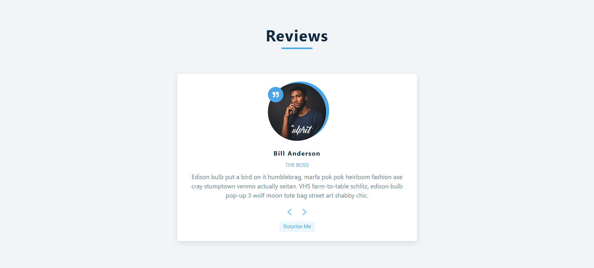

# Reviews Application

A React component that displays a rotating carousel of user reviews.



## Features

- **Review Carousel**: Cycle through reviews using Next and Previous buttons.
- **Random Review**: "Surprise me" button to show a random review.
- **Infinite Loop**: Carousel loops back to the start/end when navigating past boundaries.
- **Responsive Design**: Clean and responsive UI using standard CSS.

## Technologies Used

- React (useState)
- React Icons (`react-icons`)
- CSS

## Getting Started

### Installation

1. Install dependencies:
   ```bash
   npm install
   ```

### Usage

Start the development server:
```bash
npm start
```

The app will run at `http://localhost:3000`.
